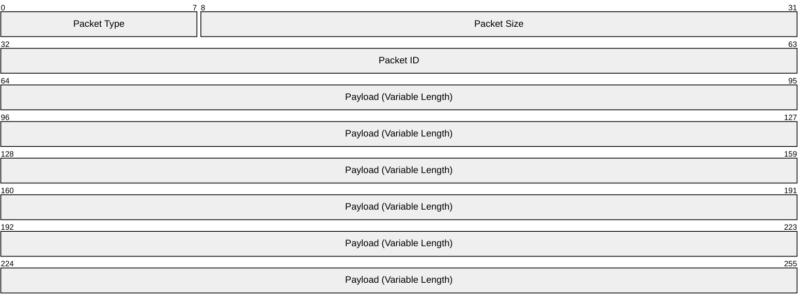

# `crtboard-display`

This repo is used on the Linux device to read form `/dev/ttyGS0` and writing to
`/dev/ttyFB0`.

```mermaid
packet
0-7: "Packet Type"
8-31: "Packet Size"
32-63: "Packet ID"
64-255: "Payload (Variable Length)"
```